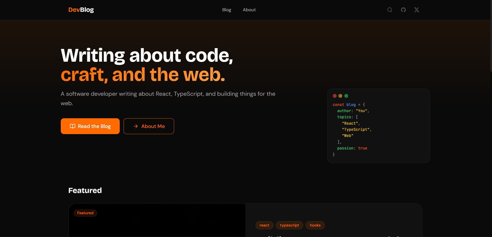
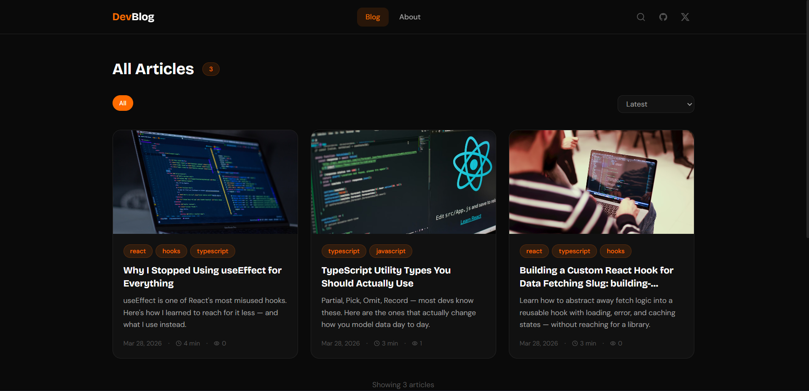
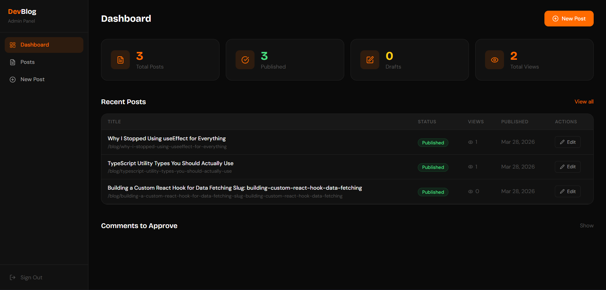

# DevBlog

[](https://yourdomain.com)
[](https://github.com/yourusername/devblog)
[](https://react.dev)
[](https://typescriptlang.org)
[](https://firebase.google.com)

A full-featured personal technical blog platform built with React, TypeScript, and Firebase. Write and publish Markdown articles through a private admin dashboard, with reader features like full-text search, emoji reactions, nested comments, and a reading progress tracker.

---

## Screenshots







---

## Features

### Reader
- Browse and filter posts by tag
- Full-text search with Fuse.js (`⌘K` / `Ctrl+K`)
- Syntax-highlighted code blocks with one-click copy
- Reading progress bar
- Emoji reactions (👍 ❤️ 🔥 😮) with confetti animation
- Nested comments with moderation queue
- Auto-generated table of contents with active heading tracking
- Share to Twitter, LinkedIn, or copy link
- Related posts by tag
- Newsletter signup
- Full SEO: OpenGraph, Twitter Card, JSON-LD structured data

### Admin
- Firebase Auth protected dashboard
- Markdown editor with live preview and auto-save
- Cover image via URL (Imgur, Unsplash, etc.)
- Draft / Published / Archived post status
- Comment moderation — approve or delete
- Post stats: views, reactions, comment count
- Fully mobile responsive

---

## Tech Stack

| Layer | Technology |
|---|---|
| Framework | React 18 |
| Build tool | Vite 5 |
| Language | TypeScript 5 (strict) |
| Styling | Tailwind CSS 3 + CSS custom properties |
| Auth | Firebase Auth 10 |
| Database | Firestore 10 |
| State | Zustand 4 |
| Data fetching | TanStack Query 5 |
| Routing | React Router 6 |
| Markdown | react-markdown 9 + rehype plugins |
| Editor | @uiw/react-md-editor 4 |
| Animations | Framer Motion 11 |
| Search | Fuse.js 7 |
| Icons | Lucide React |

---

## Getting Started

### 1. Clone and install

```bash
git clone https://github.com/yourusername/devblog.git
cd devblog
npm install
```

### 2. Set up Firebase

1. Go to [console.firebase.google.com](https://console.firebase.google.com) and create a new project
2. Enable the following services:
   - **Authentication** → Sign-in method → Email/Password → Enable
   - **Firestore Database** → Create database → Start in production mode
3. Go to Project Settings → General → Your apps → Add web app → copy the config values

### 3. Configure environment variables

```bash
cp .env.example .env
```

Fill in your Firebase credentials:

```env
VITE_FIREBASE_API_KEY=your_api_key
VITE_FIREBASE_AUTH_DOMAIN=your_project.firebaseapp.com
VITE_FIREBASE_PROJECT_ID=your_project_id
VITE_FIREBASE_STORAGE_BUCKET=your_project.appspot.com
VITE_FIREBASE_MESSAGING_SENDER_ID=your_sender_id
VITE_FIREBASE_APP_ID=your_app_id
VITE_SITE_URL=http://localhost:5173
VITE_ADMIN_EMAIL=admin@example.com
```

### 4. Set Firestore security rules

In Firebase Console → Firestore → **Rules** tab, paste the following and click **Publish**:

```javascript
rules_version = '2';
service cloud.firestore {
  match /databases/{database}/documents {

    function isAdmin() {
      return request.auth != null;
    }

    match /posts/{postId} {
      allow read: if resource.data.status == 'published' || isAdmin();
      allow create, update, delete: if isAdmin();

      match /reactions/{reactionId} {
        allow read: if true;
        allow create: if request.resource.data.keys().hasAll(['type', 'sessionId', 'createdAt'])
          && request.resource.data.type in ['like', 'love', 'fire', 'wow'];
        allow update, delete: if false;
      }

      match /comments/{commentId} {
        allow read: if resource.data.isApproved == true || isAdmin();
        allow create: if request.resource.data.keys().hasAll(['authorName', 'content', 'createdAt'])
          && request.resource.data.isApproved == false;
        allow update: if isAdmin();
        allow delete: if isAdmin();
      }
    }

    match /tags/{tagName} {
      allow read: if true;
      allow write: if isAdmin();
    }

    match /subscribers/{email} {
      allow create: if request.resource.data.keys().hasAll(['email', 'subscribedAt', 'isVerified']);
      allow read, update, delete: if isAdmin();
    }
  }
}
```

### 5. Run the dev server

```bash
npm run dev
```

Open [http://localhost:5173](http://localhost:5173)

---

## Admin Access

1. Go to Firebase Console → **Authentication** → **Users** → **Add user**
2. Enter your email and a strong password
3. Navigate to `/admin/login` and sign in

---

## Creating Your First Post

1. Sign in at `/admin/login`
2. Go to **New Post**
3. Fill in the title, excerpt, and tags
4. Paste a cover image URL (from [Unsplash](https://unsplash.com) or [Imgur](https://imgur.com) — use the direct image URL ending in `.jpg` or `.png`)
5. Write your content in Markdown
6. Click **Publish**

---

## Deployment

### Vercel (recommended)

[](https://vercel.com/new/clone?repository-url=https://github.com/yourusername/devblog)

1. Push your repo to GitHub
2. Import it at [vercel.com/new](https://vercel.com/new)
3. Add all `VITE_*` environment variables in the Vercel project settings
4. Set `VITE_SITE_URL` to your production domain
5. Deploy — Vercel auto-detects Vite

### Build locally

```bash
npm run build
npm run preview
```

---

## Project Structure

```
src/
├── api/          # Firestore CRUD functions
├── components/
│   ├── admin/    # Post editor, image uploader, posts table
│   ├── blog/     # Post cards, markdown renderer, comments, reactions
│   ├── layout/   # Header, footer, admin layout
│   ├── search/   # Search modal and results
│   └── ui/       # Button, Input, Modal, Toast, etc.
├── hooks/        # TanStack Query hooks + UI hooks
├── lib/          # Firebase init, Fuse.js, query client
├── pages/        # Route-level page components
├── store/        # Zustand stores (auth, UI)
├── styles/       # CSS tokens, globals, syntax highlight theme
└── types/        # Shared TypeScript interfaces
```

---

## License

MIT
